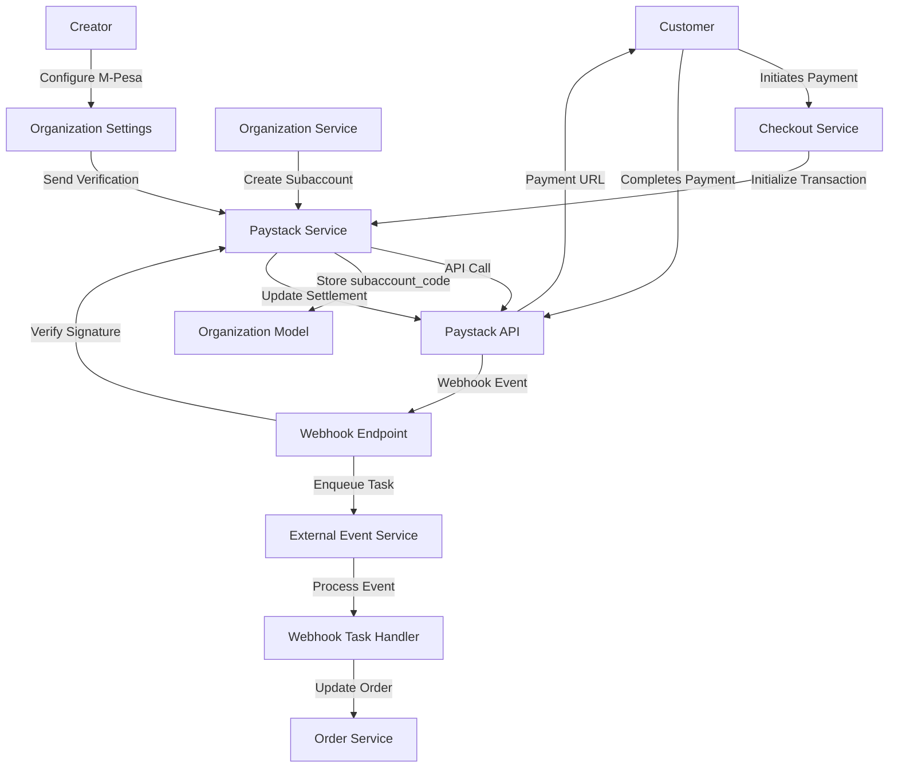

# Design Document: Paystack Integration

## Overview

This design document outlines the technical implementation for integrating Paystack as the payment processor for Blyss, a Kenya-based creator marketplace. The integration replaces Stripe with Paystack to support local payment methods (M-Pesa), automatic revenue splits between creators and platform, and Kenya-specific payment workflows.

The key architectural changes include:

- A new `PaystackService` module for API interactions
- Database schema updates to the `Organization` model for subaccount management
- Webhook endpoint for processing Paystack payment events
- Automatic payment splitting using Paystack subaccounts (80% creator, 20% platform)
- M-Pesa payout configuration with verification flow

The design maintains backward compatibility with existing Stripe orders while enabling new transactions through Paystack.

## Architecture

### High-Level Architecture



### Module Structure

Following the existing Polar architecture, the Paystack integration will be organized as:

```
server/polar/integrations/paystack/
├── __init__.py
├── service.py          # PaystackService class with API methods
├── endpoints.py        # Webhook endpoint
├── tasks.py           # Webhook event handlers
└── schemas.py         # Pydantic schemas for API requests/responses
```

### Payment Flow

1. **Checkout Initialization**: When a customer initiates checkout, the system creates a Paystack transaction with the creator's subaccount_code
2. **Payment Split Configuration**: Transaction includes split configuration (80% to creator subaccount, 20% to platform)
3. **Payment Completion**: Customer completes payment through Paystack interface (M-Pesa, card, or bank transfer)
4. **Webhook Notification**: Paystack sends `charge.success` webhook to platform
5. **Order Creation**: Webhook handler verifies payment and creates Order record
6. **Automatic Settlement**: Paystack automatically settles funds to creator's configured payout method

### Subaccount Management Flow

1. **Organization Creation**: When an organization is created, trigger subaccount creation task
2. **Subaccount API Call**: Call Paystack API to create subaccount with organization details
3. **Store Subaccount Code**: Save `subaccount_code` and `subaccount_status` in Organization model
4. **M-Pesa Configuration**: Creator configures M-Pesa number through UI
5. **Verification Transaction**: Send KES 10 to M-Pesa number to verify ownership
6. **Update Settlement Account**: On verification success, update Paystack subaccount with M-Pesa details

## Components and Interfaces

### PaystackService

The `PaystackService` class provides methods for interacting with the Paystack API. It follows the same pattern as the existing `StripeService`.

```python
class PaystackService:
    """Service for interacting with Paystack API."""

    def __init__(self):
        self.secret_key = settings.PAYSTACK_SECRET_KEY
        self.base_url = "https://api.paystack.co"

    async def initialize_transaction(
        self,
        *,
        email: str,
        amount: int,  # Amount in kobo (KES cents)
        currency: str = "KES",
        reference: str,
        subaccount: str,
        metadata: dict[str, Any] | None = None,
    ) -> dict[str, Any]:
        """Initialize a payment transaction."""

    async def verify_transaction(self, reference: str) -> dict[str, Any]:
        """Verify a transaction status."""

    async def create_subaccount(
        self,
        *,
        business_name: str,
        settlement_bank: str | None = None,
        account_number: str | None = None,
        percentage_charge: float,
    ) -> dict[str, Any]:
        """Create a subaccount for automatic payment splits."""

    async def update_subaccount(
        self,
        subaccount_code: str,
        *,
        settlement_bank: str | None = None,
        account_number: str | None = None,
    ) -> dict[str, Any]:
        """Update subaccount settlement details."""

    async def send_verification_transaction(
        self,
        *,
        mpesa_number: str,
        amount: int = 1000,  # KES 10 in kobo
    ) -> dict[str, Any]:
        """Send a small transaction to verify M-Pesa number ownership."""
```

### Webhook Endpoint

The webhook endpoint receives and processes Paystack notifications. It follows the same pattern as the Stripe webhook endpoint.

```python
@router.post("/webhook", status_code=202, name="integrations.paystack.webhook")
async def webhook(
    request: Request,
    session: AsyncSession = Depends(get_db_session),
) -> None:
    """Receive and process Paystack webhook events."""
    # 1. Get payload and signature
    # 2. Verify signature using PAYSTACK_WEBHOOK_SECRET
    # 3. Parse event type and data
    # 4. Enqueue task for async processing
```

### Webhook Event Handlers

Webhook events are processed asynchronously using Dramatiq tasks:

```python
@actor(actor_name="paystack.webhook.charge.success", priority=TaskPriority.HIGH)
async def charge_success(event_id: UUID) -> None:
    """Handle successful payment."""
    # 1. Retrieve event from database
    # 2. Extract transaction reference
    # 3. Verify transaction with Paystack API
    # 4. Create Order record
    # 5. Update Checkout status

@actor(actor_name="paystack.webhook.charge.failed", priority=TaskPriority.HIGH)
async def charge_failed(event_id: UUID) -> None:
    """Handle failed payment."""
    # 1. Retrieve event from database
    # 2. Extract transaction reference
    # 3. Update Checkout status to failed
```

### Organization Service Updates

The `OrganizationService` will be extended to handle subaccount creation:

```python
async def create_organization_subaccount(
    self,
    session: AsyncSession,
    organization: Organization,
) -> Organization:
    """Create Paystack subaccount for organization."""
    # 1. Call PaystackService.create_subaccount
    # 2. Update organization with subaccount_code
    # 3. Set subaccount_status to 'active' or 'failed'
    # 4. Return updated organization
```

### M-Pesa Configuration Endpoints

New endpoints for M-Pesa payout configuration:

```python
@router.post("/organizations/{id}/mpesa")
async def configure_mpesa(
    id: UUID,
    mpesa_number: str,
    auth_subject: WebUser,
    session: AsyncSession = Depends(get_db_session),
) -> Organization:
    """Configure M-Pesa payout for organization."""
    # 1. Validate M-Pesa number format (+254XXXXXXXXX)
    # 2. Send verification transaction
    # 3. Store M-Pesa number with verified=false
    # 4. Return updated organization

@router.post("/organizations/{id}/mpesa/verify")
async def verify_mpesa(
    id: UUID,
    auth_subject: WebUser,
    session: AsyncSession = Depends(get_db_session),
) -> Organization:
    """Mark M-Pesa number as verified after successful transaction."""
    # 1. Check verification transaction status
    # 2. Update mpesa_verified to true
    # 3. Update Paystack subaccount with M-Pesa details
    # 4. Return updated organization
```

## Data Models

### Organization Model Updates

The `Organization` model will be extended with Paystack-related fields:

```python
class Organization(RecordModel):
    # ... existing fields ...

    # Paystack subaccount fields
    subaccount_code: Mapped[str | None] = mapped_column(
        String, nullable=True, default=None
    )
    subaccount_status: Mapped[SubaccountStatus] = mapped_column(
        StringEnum(SubaccountStatus),
        nullable=False,
        default=SubaccountStatus.PENDING,
    )

    # M-Pesa payout fields
    mpesa_number: Mapped[str | None] = mapped_column(
        String, nullable=True, default=None
    )
    mpesa_verified: Mapped[bool] = mapped_column(
        Boolean, nullable=False, default=False
    )
    payout_method: Mapped[PayoutMethod] = mapped_column(
        StringEnum(PayoutMethod),
        nullable=False,
        default=PayoutMethod.BANK,
    )

class SubaccountStatus(StrEnum):
    PENDING = "pending"
    ACTIVE = "active"
    FAILED = "failed"

class PayoutMethod(StrEnum):
    BANK = "bank"
    MPESA = "mpesa"
```

### Order Model

The existing `Order` model already has fields for storing payment processor information. No changes are required, but we'll use:

- `stripe_invoice_id`: Will store Paystack transaction reference for new orders
- `tax_amount`: Tax calculations
- Platform fee will be calculated as 20% of order amount

### Database Migration

A new Alembic migration will add the Paystack fields to the Organization table:

```python
def upgrade() -> None:
    op.add_column('organizations', sa.Column('subaccount_code', sa.String(), nullable=True))
    op.add_column('organizations', sa.Column('subaccount_status', sa.String(), nullable=False, server_default='pending'))
    op.add_column('organizations', sa.Column('mpesa_number', sa.String(), nullable=True))
    op.add_column('organizations', sa.Column('mpesa_verified', sa.Boolean(), nullable=False, server_default='false'))
    op.add_column('organizations', sa.Column('payout_method', sa.String(), nullable=False, server_default='bank'))

def downgrade() -> None:
    op.drop_column('organizations', 'payout_method')
    op.drop_column('organizations', 'mpesa_verified')
    op.drop_column('organizations', 'mpesa_number')
    op.drop_column('organizations', 'subaccount_status')
    op.drop_column('organizations', 'subaccount_code')
```

### Configuration

Environment variables for Paystack configuration:

```python
# In polar/config.py
class Settings(BaseSettings):
    # ... existing settings ...

    # Paystack configuration
    PAYSTACK_SECRET_KEY: str = ""
    PAYSTACK_PUBLIC_KEY: str = ""
    PAYSTACK_WEBHOOK_SECRET: str = ""

    # Platform fee (20% = 2000 basis points)
    PLATFORM_FEE_BASIS_POINTS: int = 2000
```

## Correctness Properties

_A property is a characteristic or behavior that should hold true across all valid executions of a system-essentially, a formal statement about what the system should do. Properties serve as the bridge between human-readable specifications and machine-verifiable correctness guarantees._

After analyzing the acceptance criteria and performing property reflection to eliminate redundancy, the following properties have been identified for testing:

### Property 1: Transaction Initialization Returns Required Fields

_For any_ valid transaction parameters (email, amount, currency, reference, subaccount), initializing a Paystack transaction should return both a payment reference and an authorization URL.

**Validates: Requirements 1.1, 1.3**

### Property 2: Transaction Verification Returns Valid Status

_For any_ transaction reference, verifying the transaction with Paystack should return a valid status response containing transaction details.

**Validates: Requirements 1.2**

### Property 3: API Errors Produce Descriptive Exceptions

_For any_ Paystack API error response, the PaystackService should raise a specific exception with a descriptive error message that includes the error type and details.

**Validates: Requirements 1.5, 9.2**

### Property 4: API Interactions Are Logged

_For any_ Paystack API call (successful or failed), there should be a corresponding log entry containing the request details and response status.

**Validates: Requirements 1.6, 9.1**

### Property 5: Webhook Signature Verification

_For any_ webhook payload with a valid signature, the webhook endpoint should accept and process it; for any payload with an invalid signature, the endpoint should reject it with HTTP 401.

**Validates: Requirements 2.2, 2.3**

### Property 6: Webhook Event Parsing

_For any_ valid webhook request, the platform should successfully parse the event type and payload data without errors.

**Validates: Requirements 2.4**

### Property 7: Charge Success Creates Order

_For any_ charge.success webhook event with a valid transaction reference, the platform should create an order record and mark the associated checkout as confirmed.

**Validates: Requirements 2.5, 6.5**

### Property 8: Charge Failed Updates Checkout

_For any_ charge.failed webhook event, the platform should mark the associated checkout as failed without creating an order.

**Validates: Requirements 2.6**

### Property 9: Webhook Events Are Stored

_For any_ webhook event received (regardless of type), the platform should store it in the database for audit purposes.

**Validates: Requirements 2.7**

### Property 10: Webhook Idempotency

_For any_ webhook event received multiple times with the same event ID, the platform should process it only once, preventing duplicate orders or status updates.

**Validates: Requirements 2.9**

### Property 11: Organization Subaccount Creation

_For any_ newly created organization, the platform should create a Paystack subaccount and store the subaccount_code in the organization record.

**Validates: Requirements 3.1, 3.2**

### Property 12: Subaccount Settlement Percentage

_For any_ subaccount created by the platform, it should be configured with an 80% settlement percentage to the creator.

**Validates: Requirements 3.3, 4.2**

### Property 13: Subaccount Status Tracking

_For any_ organization, the subaccount_status field should always contain a valid status value (pending, active, or failed), and failed status should only be set when subaccount creation actually fails.

**Validates: Requirements 3.4, 3.5**

### Property 14: Subaccount Business Name Matches Organization

_For any_ organization with a subaccount, the subaccount's business name should match the organization's name.

**Validates: Requirements 3.7**

### Property 15: Subaccount Updates Propagate

_For any_ organization with an active subaccount, when the organization's settlement details (bank account or M-Pesa number) are updated, the Paystack subaccount should be updated accordingly.

**Validates: Requirements 3.8**

### Property 16: Payment Includes Subaccount Code

_For any_ payment initialization, the transaction should include the creator organization's subaccount_code to enable automatic payment splitting.

**Validates: Requirements 4.1**

### Property 17: Platform Fee Calculation

_For any_ order created through Paystack, the platform_fee_amount should equal exactly 20% of the order amount, and the creator payout should equal the order amount minus the platform fee.

**Validates: Requirements 4.4, 7.2, 7.3, 7.5**

### Property 18: Order Split Amounts Recorded

_For any_ order created through Paystack, both the platform fee amount and creator payout amount should be recorded in the order data.

**Validates: Requirements 4.5**

### Property 19: Currency Consistency

_For any_ Paystack transaction, the currency should be KES, and the platform_fee_amount should be stored in the same currency as the order amount.

**Validates: Requirements 4.6, 7.6**

### Property 20: Inactive Subaccount Prevents Payment

_For any_ payment initialization attempt where the organization's subaccount_status is not "active", the platform should reject the payment initialization and return an error.

**Validates: Requirements 4.7**

### Property 21: M-Pesa Number Format Validation

_For any_ M-Pesa number input, the platform should accept it only if it matches the Kenyan format (+254XXXXXXXXX where X is a digit), and reject any other format with a validation error.

**Validates: Requirements 5.2**

### Property 22: M-Pesa Verification Transaction

_For any_ valid M-Pesa number submission, the platform should send a KES 10 verification transaction and store the M-Pesa number with verified status set to false.

**Validates: Requirements 5.3, 5.4**

### Property 23: M-Pesa Verification Updates Status

_For any_ M-Pesa number with a successful verification transaction, the platform should mark mpesa_verified as true and update the Paystack subaccount with the M-Pesa number as the settlement account.

**Validates: Requirements 5.5, 5.6**

### Property 24: Unverified M-Pesa Numbers Not Used for Payouts

_For any_ organization with an M-Pesa number where mpesa_verified is false, the platform should not configure that M-Pesa number as the settlement account in Paystack.

**Validates: Requirements 5.9**

### Property 25: Failed Verification Preserves Unverified Status

_For any_ M-Pesa verification transaction that fails, the mpesa_verified field should remain false and the subaccount should not be updated with the M-Pesa number.

**Validates: Requirements 5.8**

### Property 26: Checkout Initializes Paystack Transaction

_For any_ checkout creation, the platform should initialize a Paystack transaction and return the authorization URL to the customer.

**Validates: Requirements 6.1, 6.2**

### Property 27: Payment Verification Before Order Creation

_For any_ payment completion webhook, the platform should verify the transaction status with Paystack before creating an order record.

**Validates: Requirements 6.4**

### Property 28: Transaction Reference Stored in Order

_For any_ order created from a Paystack payment, the order should contain the Paystack transaction reference for tracking and reconciliation.

**Validates: Requirements 6.6**

### Property 29: Tax Calculation Before Payment

_For any_ checkout, tax amounts should be calculated and included in the total before initializing the Paystack transaction.

**Validates: Requirements 6.7**

### Property 30: Order Metadata in Transaction

_For any_ Paystack transaction, the transaction should include order metadata (such as order ID, customer information) for tracking purposes.

**Validates: Requirements 6.8**

### Property 31: Failed Verification Returns Checkout to Open

_For any_ payment verification that fails, the associated checkout should be returned to open status, allowing the customer to retry payment.

**Validates: Requirements 6.9**

### Property 32: Sensitive Data Not in Logs

_For any_ log entry or error message generated by the platform, it should not contain sensitive data such as API keys, webhook secrets, or full payment card numbers.

**Validates: Requirements 9.6**

### Property 33: Stripe Orders Remain Unchanged

_For any_ existing order with Stripe payment data, the order record should remain unmodified when the Paystack integration is deployed.

**Validates: Requirements 10.1**

### Property 34: Query Support for Both Processors

_For any_ order query, the platform should successfully return orders regardless of whether they were processed through Stripe or Paystack.

**Validates: Requirements 10.2**

### Property 35: Payment Processor Type Displayed

_For any_ order, the order details should indicate which payment processor (Stripe or Paystack) was used for the transaction.

**Validates: Requirements 10.3**

### Property 36: Webhook Routing Separation

_For any_ Stripe webhook event, the platform should not route it to Paystack webhook handlers, and vice versa.

**Validates: Requirements 10.4**

## Error Handling

### PaystackService Error Handling

The `PaystackService` will implement comprehensive error handling following the existing Polar patterns:

```python
class PaystackError(PolarError):
    """Base exception for Paystack-related errors."""
    pass

class PaystackAuthenticationError(PaystackError):
    """Raised when API authentication fails."""
    def __init__(self, message: str):
        super().__init__(message, 401)

class PaystackValidationError(PaystackError):
    """Raised when API request validation fails."""
    def __init__(self, message: str, field: str | None = None):
        self.field = field
        super().__init__(message, 422)

class PaystackNetworkError(PaystackError):
    """Raised when network communication with Paystack fails."""
    def __init__(self, message: str):
        super().__init__(message, 503)

class PaystackTransactionError(PaystackError):
    """Raised when transaction processing fails."""
    def __init__(self, message: str, transaction_reference: str | None = None):
        self.transaction_reference = transaction_reference
        super().__init__(message, 422)
```

### Error Scenarios

1. **Subaccount Creation Failure**: If Paystack API returns an error during subaccount creation, the organization's `subaccount_status` is set to "failed" and the error message is logged. The UI displays a retry option.

2. **Payment Initialization Failure**: If payment initialization fails (e.g., inactive subaccount, invalid amount), a `PaystackTransactionError` is raised with a user-friendly message.

3. **Webhook Signature Verification Failure**: Invalid webhook signatures result in HTTP 401 response without processing the event.

4. **M-Pesa Verification Failure**: If the verification transaction fails, the M-Pesa number remains unverified and the user can retry.

5. **Network Errors**: Transient network errors are logged and can trigger retry logic in background tasks.

### Logging Strategy

All Paystack interactions will be logged with structured logging using `structlog`:

```python
log.info(
    "paystack.transaction.initialize",
    email=email,
    amount=amount,
    currency=currency,
    reference=reference,
    subaccount=subaccount,
)

log.error(
    "paystack.api.error",
    error_type=error_type,
    error_message=error_message,
    status_code=status_code,
    # Never log sensitive data like API keys
)

log.info(
    "paystack.webhook.received",
    event_type=event_type,
    event_id=event_id,
    # Log payload structure but sanitize sensitive data
)
```

### Retry Logic

Background tasks for webhook processing will implement retry logic using Dramatiq's built-in retry mechanism:

```python
@actor(
    actor_name="paystack.webhook.charge.success",
    priority=TaskPriority.HIGH,
    max_retries=3,
    min_backoff=1000,  # 1 second
    max_backoff=60000,  # 1 minute
)
async def charge_success(event_id: UUID) -> None:
    # Process webhook event with automatic retries on failure
    pass
```

## Testing Strategy

The Paystack integration will be tested using a dual approach combining unit tests and property-based tests.

### Unit Testing

Unit tests will focus on:

1. **Specific Examples**: Testing concrete scenarios like successful payment flow, failed payment handling
2. **Edge Cases**: Empty responses, malformed webhook payloads, boundary values
3. **Integration Points**: Mocking Paystack API responses to test service layer
4. **Database Operations**: Verifying correct storage of subaccount data, order records

Example unit test structure:

```python
class TestPaystackService:
    class TestInitializeTransaction:
        async def test_successful_initialization(self, session):
            # Test successful transaction initialization
            pass

        async def test_inactive_subaccount_raises_error(self, session):
            # Test that inactive subaccount prevents payment
            pass

    class TestVerifyTransaction:
        async def test_successful_verification(self, session):
            # Test successful transaction verification
            pass
```

### Property-Based Testing

Property-based tests will verify universal properties across all inputs using the `hypothesis` library for Python. Each property test will run a minimum of 100 iterations with randomized inputs.

**Property Test Configuration**:

- Library: `hypothesis` (Python's property-based testing library)
- Minimum iterations: 100 per test
- Each test references its design document property

Example property test structure:

```python
from hypothesis import given, strategies as st

class TestPaystackProperties:
    @given(
        email=st.emails(),
        amount=st.integers(min_value=100, max_value=10000000),  # KES 1 to 100,000
        reference=st.text(min_size=10, max_size=50),
    )
    async def test_property_1_transaction_initialization_returns_required_fields(
        self, email, amount, reference, organization_with_active_subaccount
    ):
        """
        Feature: paystack-integration, Property 1: Transaction Initialization Returns Required Fields

        For any valid transaction parameters, initializing a Paystack transaction
        should return both a payment reference and an authorization URL.
        """
        result = await paystack_service.initialize_transaction(
            email=email,
            amount=amount,
            currency="KES",
            reference=reference,
            subaccount=organization_with_active_subaccount.subaccount_code,
        )

        assert "reference" in result
        assert "authorization_url" in result
        assert result["reference"] is not None
        assert result["authorization_url"].startswith("https://")

    @given(
        order_amount=st.integers(min_value=100, max_value=10000000),
    )
    async def test_property_17_platform_fee_calculation(self, order_amount):
        """
        Feature: paystack-integration, Property 17: Platform Fee Calculation

        For any order created through Paystack, the platform_fee_amount should equal
        exactly 20% of the order amount.
        """
        platform_fee = calculate_platform_fee(order_amount)
        creator_payout = order_amount - platform_fee

        assert platform_fee == order_amount * 0.20
        assert creator_payout == order_amount * 0.80
        assert platform_fee + creator_payout == order_amount
```

### Test Coverage Goals

- Unit test coverage: Minimum 80% for new code
- Property test coverage: All 36 correctness properties implemented
- Integration test coverage: End-to-end payment flow, webhook processing
- Edge case coverage: Error scenarios, boundary conditions, invalid inputs

### Mocking Strategy

For unit tests, Paystack API calls will be mocked using `unittest.mock.MagicMock`:

```python
@pytest.fixture
def mock_paystack_api(monkeypatch):
    mock_response = {
        "status": True,
        "message": "Authorization URL created",
        "data": {
            "authorization_url": "https://checkout.paystack.com/test123",
            "access_code": "test_access_code",
            "reference": "test_reference_123",
        }
    }

    async def mock_initialize(*args, **kwargs):
        return mock_response

    monkeypatch.setattr(
        "polar.integrations.paystack.service.PaystackService.initialize_transaction",
        mock_initialize
    )
    return mock_response
```

### Test Environment Setup

Testing will use Paystack's test mode with test API keys:

```python
# In test configuration
PAYSTACK_SECRET_KEY = "sk_test_xxxxxxxxxxxxx"
PAYSTACK_PUBLIC_KEY = "pk_test_xxxxxxxxxxxxx"
PAYSTACK_WEBHOOK_SECRET = "test_webhook_secret"
```

Test data generators will create:

- Random organization data with subaccounts
- Random transaction references
- Random M-Pesa numbers in valid format
- Random order amounts and metadata
- Mock webhook payloads with valid signatures

### Continuous Integration

Tests will run in CI pipeline:

1. Unit tests run on every commit
2. Property tests run on every pull request
3. Integration tests run before deployment
4. Test coverage reports generated and tracked

## Implementation Phases

### Phase 1: Core Infrastructure (Week 1)

- Create `PaystackService` class with basic API methods
- Implement webhook endpoint with signature verification
- Add database migration for Organization model fields
- Set up environment configuration

### Phase 2: Subaccount Management (Week 2)

- Implement subaccount creation on organization creation
- Add retry logic for failed subaccount creation
- Create UI for viewing subaccount status
- Implement subaccount update functionality

### Phase 3: Payment Flow (Week 3)

- Integrate Paystack transaction initialization in checkout flow
- Implement webhook handlers for charge.success and charge.failed
- Add payment verification logic
- Update order creation to store Paystack transaction references

### Phase 4: M-Pesa Configuration (Week 4)

- Create M-Pesa configuration endpoints
- Implement M-Pesa number validation
- Add verification transaction flow
- Update subaccount with verified M-Pesa details

### Phase 5: Testing and Refinement (Week 5)

- Write comprehensive unit tests
- Implement property-based tests for all 36 properties
- Perform end-to-end testing with Paystack test mode
- Fix bugs and refine error handling

### Phase 6: Deployment and Monitoring (Week 6)

- Deploy to staging environment
- Test with real Paystack test transactions
- Set up monitoring and alerting
- Deploy to production with feature flag
- Monitor payment success rates and error logs

## Security Considerations

1. **API Key Protection**: Paystack API keys stored in environment variables, never committed to code
2. **Webhook Signature Verification**: All webhook requests verified using HMAC signature
3. **M-Pesa Number Privacy**: M-Pesa numbers stored encrypted at rest
4. **Audit Logging**: All payment operations logged for security auditing
5. **Rate Limiting**: Webhook endpoint protected by rate limiting to prevent abuse
6. **Input Validation**: All user inputs validated before processing
7. **Error Message Sanitization**: Error messages never expose sensitive data

## Monitoring and Observability

Key metrics to monitor:

- Payment success rate (target: >95%)
- Payment failure rate by error type
- Webhook processing latency (target: <5 seconds)
- Subaccount creation success rate
- M-Pesa verification success rate
- API error rates by endpoint

Alerts configured for:

- Payment success rate drops below 90%
- Webhook processing failures exceed 5%
- API error rate exceeds 10%
- Subaccount creation failures exceed 20%

## Migration Strategy

### Backward Compatibility

The integration maintains full backward compatibility with existing Stripe orders:

- Existing Stripe order records remain unchanged
- Stripe webhook handlers continue to function
- Order queries work for both Stripe and Paystack orders
- UI displays payment processor type for each order

### Gradual Rollout

1. **Phase 1**: Deploy with feature flag disabled, test in production environment
2. **Phase 2**: Enable for internal testing with test organizations
3. **Phase 3**: Enable for beta users (10% of new organizations)
4. **Phase 4**: Gradual rollout to all new organizations (25%, 50%, 75%, 100%)
5. **Phase 5**: Migrate existing organizations to Paystack (optional, based on business decision)

### Rollback Plan

If critical issues are discovered:

1. Disable feature flag to stop new Paystack transactions
2. Existing Paystack orders continue to be processed via webhooks
3. Investigate and fix issues in staging environment
4. Re-enable feature flag after validation

## Dependencies

### External Dependencies

- Paystack API (https://api.paystack.co)
- Paystack Python SDK (optional, or use direct HTTP requests)

### Internal Dependencies

- `polar.integrations.stripe.service`: Reference implementation pattern
- `polar.external_event.service`: Webhook event queuing
- `polar.order.service`: Order creation
- `polar.checkout.service`: Checkout management
- `polar.organization.service`: Organization management

### Python Package Dependencies

- `httpx`: For async HTTP requests to Paystack API
- `hypothesis`: For property-based testing
- `pytest`: For unit testing
- `structlog`: For structured logging

## Open Questions

1. **M-Pesa Settlement Timing**: What is the expected settlement time for M-Pesa payouts? (Need to document for users)
2. **Currency Support**: Should we support multiple currencies or only KES? (Requirements specify KES only)
3. **Refund Handling**: How should refunds be handled with split payments? (Not covered in requirements)
4. **Dispute Management**: How should payment disputes be handled? (Not covered in requirements)
5. **Payout Schedule**: Should creators receive payouts immediately or on a schedule? (Paystack handles this)

## References

- [Paystack API Documentation](https://paystack.com/docs/api/)
- [Paystack Subaccounts Guide](https://paystack.com/docs/payments/split-payments/)
- [Paystack Webhooks Guide](https://paystack.com/docs/payments/webhooks/)
- [M-Pesa Integration Guide](https://paystack.com/docs/payments/mobile-money/)
- [Polar Architecture Documentation](../../../DEVELOPMENT.md)
- [Stripe Integration Reference](../../server/polar/integrations/stripe/)
